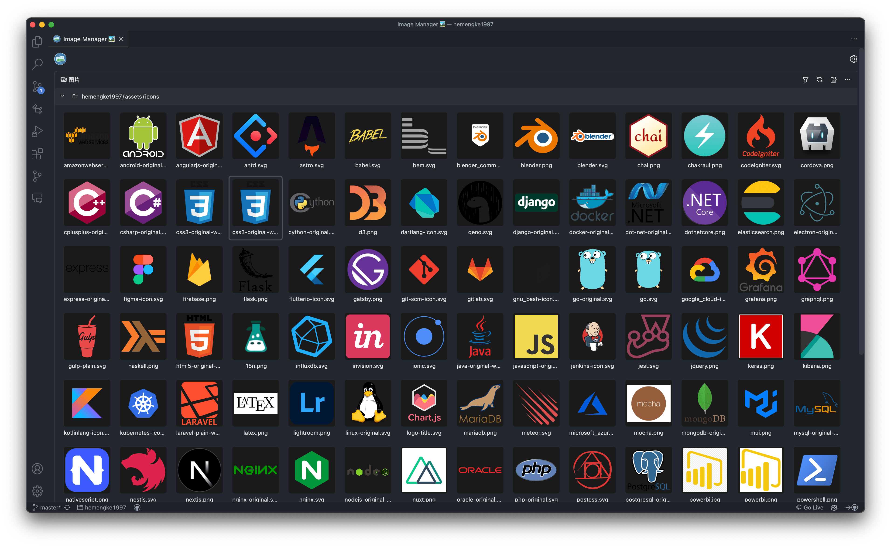
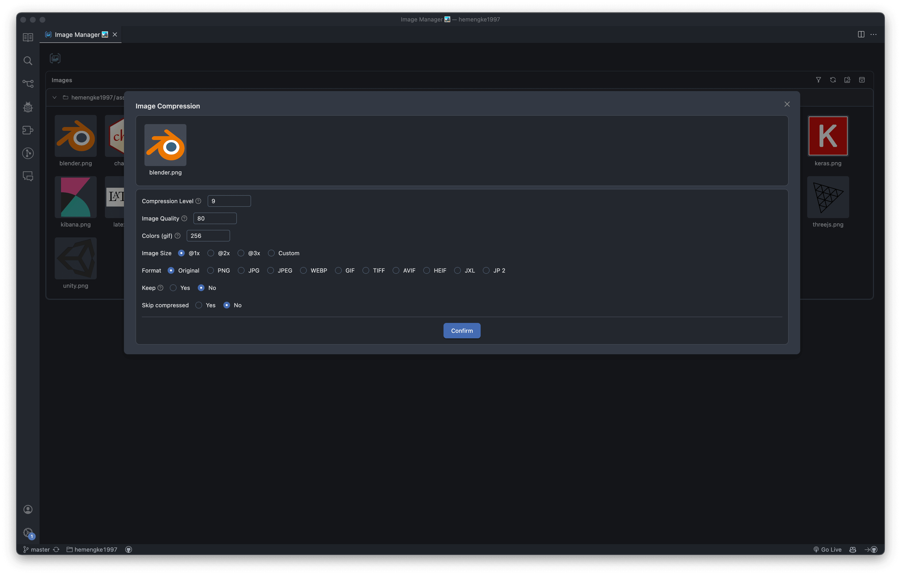
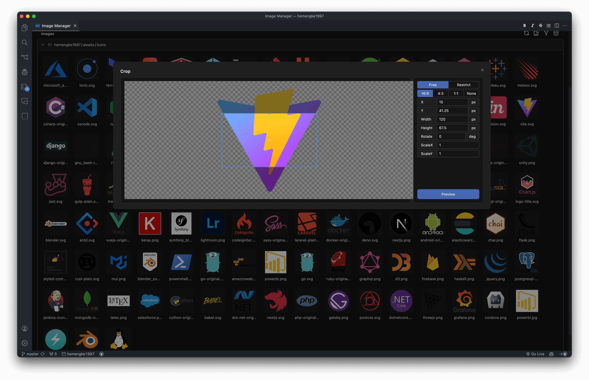
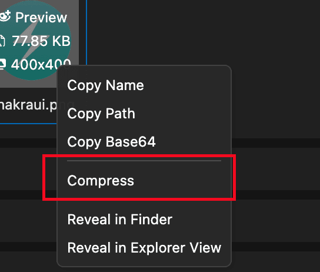
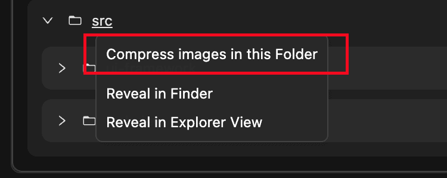

  

<h1 align='center'>Image Manager</h1>

> Compress, crop, convert format and preview images in vscode

[中文 README](./README.md)

## Screenshot

### Overview

### Preview

### Compression

### Crop

## Features

- **Batch image compression** (magic happens on right-click 🤩)
- **Images Cropper**
- **Image Viewer**
- **Finding similar images**
- View image details
- Finding images
- Conditional filtering of images
- Dark/light theme
- I18n. Currently support `english` and `简体中文`

## Usage

**Several ways open extension**

### Shortcut

- windows: `shift+alt+i`
- macos: `cmd+option+i`

### Command

`ctrl+shift+p` (macos `cmd+shift+p`), input `Image Manager` to open. (Open workspace root folder)

### Context Menu

Right click in Explorer, select `Image Manager` to open extension. (Open current folder)

## Extension Configurations

| Name                                           | Type                    | Description                                                                                     | Default value                                                                                                                |
| ---------------------------------------------- | ----------------------- | ----------------------------------------------------------------------------------------------- | ---------------------------------------------------------------------------------------------------------------------------- |
| image-manager.file.root                        | `string[]`              | root folder to scan images                                                                      | current workspace                                                                                                            |
| image-manager.file.exclude                     | `string[]`              | scan images not in exclude                                                                      | `['**/node_modules/**','**/.git/**',` `'**/dist/**','**/coverage/**','**/.next/**',` `'**/.nuxt/**','**/.vercel/**']` |
| image-manager.file.scan                        | `string[]`              | scan images with imageType                                                                      | `['svg','png','jpeg','jpg',` `'ico','gif','webp','bmp',` `'tif','tiff','apng','avif']`                               |
| image-manager.file.confirmDelete               | `boolean`               | controls whether ask for confirmation when deleting a image                                     | true                                                                                                                         |
| image-manager.appearance.theme                 | `dark \| light \| auto` | theme                                                                                           | `auto`                                                                                                                       |
| image-manager.appearance.language              | `en \| zh-CN \| auto`   | language                                                                                        | `auto`                                                                                                                       |
| image-manager.appearance.primaryColor          | `string`                | primary color                                                                                   | undefined                                                                                                                    |
| image-manager.viewer.warningSize               | `number \| boolean`     | show warning dot if image size is larger than this value (KB)                                   | 1024                                                                                                                         |
| image-manager.viewer.imageWidth                | `number`                | width of image (px)                                                                             | 100                                                                                                                          |
| image-manager.viewer.imageBackgroundColor      | `string`                | image background color                                                                          | `#1a1a1a`                                                                                                                    |
| image-manager.mirror.enabled                   | `boolean`               | use mirror for downloading dependencies                                                         | false                                                                                                                        |
| image-manager.mirror.url                       | `string`                | custom mirror url (No need to custom this in general)                                           | undefined                                                                                                                    |
| image-manager.compression.keepOriginal         | `boolean`               | keep original image after compression                                                           | false                                                                                                                        |
| image-manager.compression.fileSuffix           | `string`                | add suffix to compressed image                                                                  | `.min`                                                                                                                       |
| image-manager.compression.skipCompressed       | `boolean`               | skip the compressed images                                                                      | true                                                                                                                         |
| image-manager.compression.quality              | `number`                | compression quality                                                                             | -                                                                                                                            |
| image-manager.compression.size                 | `number`                | image size (x scale factor)                                                                     | 1                                                                                                                            |
| image-manager.compression.format               | `string`                | convert format after compression                                                                | ''                                                                                                                           |
| image-manager.compression.png.compressionLevel | `number`                | compression level of png                                                                        | 9                                                                                                                            |
| image-manager.compression.gif.colors           | `number`                | image colors of gif                                                                             | 256                                                                                                                          |
| image-manager.compression.svg.*                | `svgo 配置`             | svgo config. Please refer to svgo offical docs                                                  | -                                                                                                                            |
| image-manager.conversion.format                | `string`                | convert format                                                                                  | ''                                                                                                                           |
| image-manager.conversion.keepOriginal          | `boolean`               | keep original image after format conversion                                                     | false                                                                                                                        |
| image-manager.similarity.precision             | `number`                | determining the precision of image similarity. The smaller the value, the stricter the judgment | 10                                                                                                                           |

## Tips

### Compression

- Right click on the image

- Right click on the folder

### Viewer

- `cmd/ctrl + Mouse Wheel` to scale image size
- `cmd/ctrl + F` to open `Search` modal

### Common Questions

#### Why is opening the extension slow at the first time?

The first time you open the extension, it will need to download the necessary dependencies. Depending on your network environment, this process may be slow. Please be patient!

## Thanks

❤️ [vscode-image-viewer](https://github.com/ZhangJian1713/vscode-image-viewer)

❤️ [vscode-svgo](https://github.com/1000ch/vscode-svgo)
