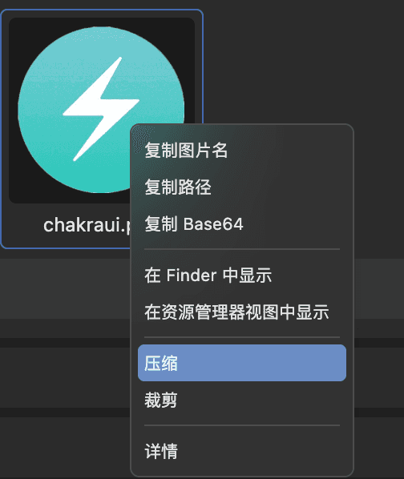
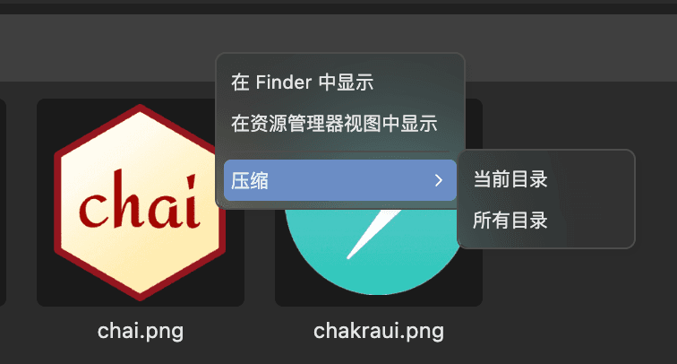
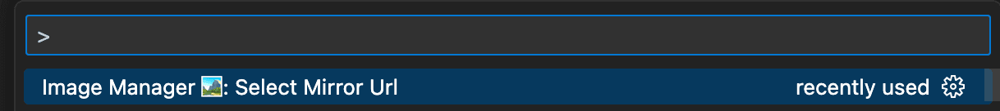
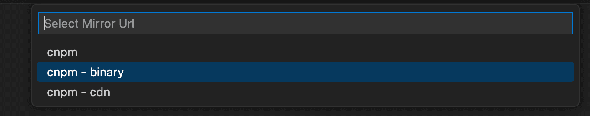

  

<h1 align='center'>Image Manager</h1>

> 压缩、裁剪、转换格式和预览图片的vscode插件

[English README](./README.en.md)

[功能介绍文章](https://juejin.cn/post/7348004403016794147)

## 插件截图

### 概览

### 大图预览

### 压缩

### 裁剪

## 核心功能

- **图片批量压缩** (右键总会发生魔法 🤩)
- **图片裁剪**
- **图片大图浏览**
- **相似图片查找**
- 查看图片详情（尺寸、体积等）
- 查找图片
- 条件筛选图片
- 暗黑/明亮主题，自定义UI主题色
- 国际化。目前支持 `english` 和 `简体中文`

## 使用方法

**有以下几种方式打开插件**

### 快捷键

- windows: `shift+alt+i`
- macos: `cmd+option+i`

### 命令面板

`ctrl+shift+p` (macos `cmd+shift+p`) 打开命令面板, 输入 `Image Manager` 选择打开

### 右键菜单

资源管理器中右键选择 `Image Manager 🏞️` 打开插件

## 插件配置项

| 配置项名称                                     | 数据类型                | 描述                                            | 默认值                                                                                                                       |
| ---------------------------------------------- | ----------------------- | ----------------------------------------------- | ---------------------------------------------------------------------------------------------------------------------------- |
| image-manager.file.root                        | `string[]`              | 扫描图片的根目录                                | 当前工作区                                                                                                                   |
| image-manager.file.exclude                     | `string[]`              | 排除目录                                        | `['**/node_modules/**','**/.git/**',` `'**/dist/**','**/coverage/**','**/.next/**',` `'**/.nuxt/**','**/.vercel/**']` |
| image-manager.file.scan                        | `string[]`              | 扫描的图片类型                                  | `['svg','png','jpeg','jpg',` `'ico','gif','webp','bmp',` `'tif','tiff','apng','avif']`                               |
| image-manager.file.confirmDelete               | `boolean`               | 删除图片时是否询问                              | true                                                                                                                         |
| image-manager.appearance.theme                 | `dark \| light \| auto` | 主题                                            | `auto`                                                                                                                       |
| image-manager.appearance.language              | `en \| zh-CN \| auto`   | 语言                                            | `auto`                                                                                                                       |
| image-manager.appearance.primaryColor          | `string`                | 主题色                                          | undefined                                                                                                                    |
| image-manager.viewer.warningSize               | `number \| boolean`     | 当图片体积大于此值时右上角展示警告点（KB）      | 1024                                                                                                                         |
| image-manager.viewer.imageWidth                | `number`                | 图片宽度（px）                                  | 100                                                                                                                          |
| image-manager.viewer.imageBackgroundColor      | `string`                | 图片背景色                                      | `#1a1a1a`                                                                                                                    |
| image-manager.mirror.enabled                   | `boolean`               | 使用镜像下载依赖                                | false                                                                                                                        |
| image-manager.mirror.url                       | `string`                | 镜像地址（通常情况不需要自定义）                | undefined                                                                                                                    |
| image-manager.compression.keepOriginal         | `boolean`               | 压缩后保留原图                                  | false                                                                                                                        |
| image-manager.compression.fileSuffix           | `string`                | 压缩图片文件名添加后缀                          | `.min`                                                                                                                       |
| image-manager.compression.skipCompressed       | `boolean`               | 跳过已压缩的图片                                | true                                                                                                                         |
| image-manager.compression.quality              | `number`                | 压缩图片质量                                    | -                                                                                                                            |
| image-manager.compression.size                 | `number`                | 图片尺寸（几倍图）                              | 1                                                                                                                            |
| image-manager.compression.format               | `string`                | 压缩时转化图片的格式                            | ''                                                                                                                           |
| image-manager.compression.png.compressionLevel | `number`                | png图片压缩等级                                 | 9                                                                                                                            |
| image-manager.compression.gif.colors           | `number`                | gif图片色彩                                     | 256                                                                                                                          |
| image-manager.compression.svg.*                | `svgo 配置`             | 压缩svg的配置，具体配置项功能请参考svgo官方文档 | -                                                                                                                            |
| image-manager.conversion.format                | `string`                | 转化图片格式                                    | ''                                                                                                                           |
| image-manager.conversion.keepOriginal          | `boolean`               | 转化图片格式后保留原图                          | false                                                                                                                        |
| image-manager.similarity.precision             | `number`                | 判断图片相似的精确度。值越小，判断越严格        | 10                                                                                                                           |

## 小贴士

### 关于配置

大部分配置可以在插件页面中设置，比如主题、语言等，当然也可以在 `settings.json` 中设置

### 压缩

- 在图片上右键，可以单独压缩一张图片

- 在文件夹上右键，可以批量压缩文件夹下的图片

### 浏览区域

- `cmd/ctrl + 鼠标滚轮` 可以缩放图片大小
- `cmd/ctrl + F` 可以打开搜索窗口

### 常见问题

#### 为什么第一次打开插件很慢？

由于首次打开插件时，需要下载必要依赖，此过程跟您的网络环境有关，可能会比较慢，请耐心等待

#### 报错：依赖安装失败，请检查网络

如果您是在中国大陆，且网络环境不佳（懂的都懂）
有两种解决方案：
1. 切换镜像源
2. 手动安装依赖

##### 如何切换镜像源

使用命令面板，输入 `select mirror url`，选择回车

然后选择一个镜像源，重启vscode尝试重新下载依赖

如果切换镜像源之后依然安装失败，请手动安装依赖

##### 如何手动安装依赖

1. 打开命令面板，输入 `Show Output Channel`，选择 Image Manager 对应的选项
2. 在输出中找到 `插件根目录` 和 `系统平台`，之后需要用到
3. 去CNPM镜像网站下载依赖：https://registry.npmmirror.com/binary.html?path=sharp-libvips/v8.14.5/ 。找到 步骤2 的`系统平台` 对应的依赖。比如你是 `darwin-arm64v8`，就下载 `libvips-8.14.5-darwin-arm64v8.tar.br` 
4. 将下载的依赖直接放在 步骤2 的`插件根目录`
5. 重启vscode即可

#### 为什么压缩后文件反而变大了？

- 由于压缩时添加了「是否已压缩」的元信息，所以可能导致小体积图片压缩后变大

## 感谢

❤️ [vscode-image-viewer](https://github.com/ZhangJian1713/vscode-image-viewer)
❤️ [vscode-svgo](https://github.com/1000ch/vscode-svgo)
