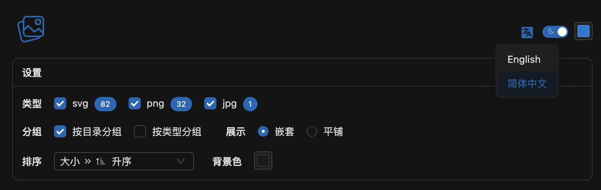
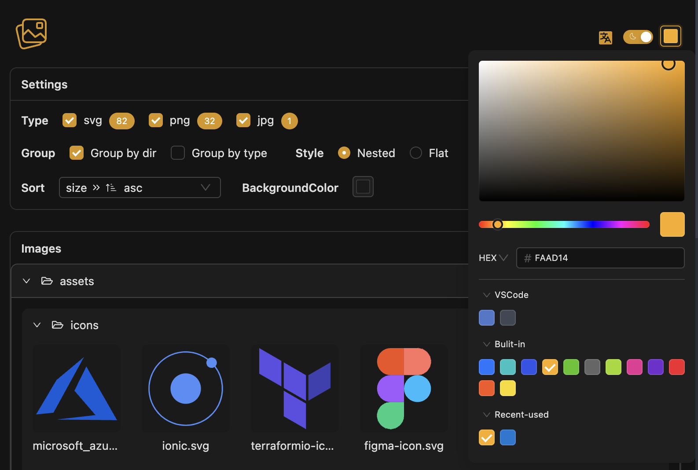
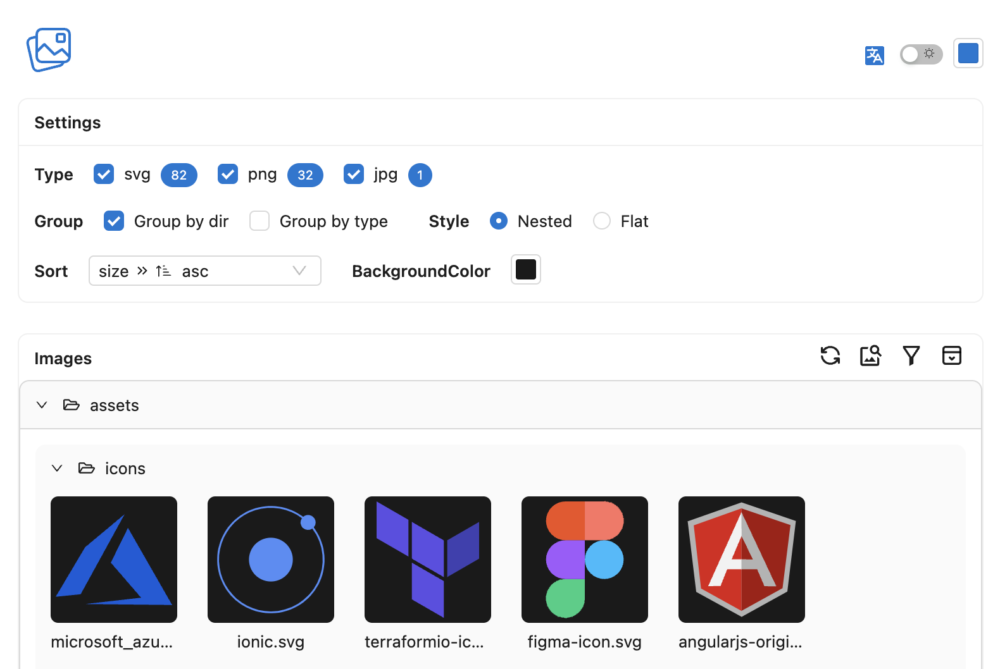

# Image Analysor

## Warning

目前正在快速迭代中，功能可能不稳定，如遇到问题请提[issue](https://github.com/hemengke1997/vscode-image-analysor/issues)

## Screenshot

### overview

### i18n 

### primary color

### preview

### theme

## Usage

**有多种方式打开插件**

### 快捷键

- windows: `shift+alt+i`
- macos: `cmd+option+i`

### 命令

`ctrl+shift+p` (macos `cmd+shift+p`)打开命令面板，输入 `Open Image Analysor` 打开插件

### 右键菜单

在资源管理器中右键，选择 `Open Image Analysor` 打开插件

## Features

- group 图片分组
- sort 图片排序
- filter 图片筛选
- search 图片搜索
- scale 图片缩放（ctrl or cmd + 鼠标滚轮）
- preview 图片预览
- theme 动态主题

## TODO

- [ ] 图片裁剪
- [ ] copy,paste,delete,move 图片操作
- [ ] deplicate image 相似图片去重
- [ ] tiny 图片压缩
- [ ] OCR 图片文字识别
- [x] vscode configuration

## Inspired

❤️ [vscode-image-viewer](https://github.com/ZhangJian1713/vscode-image-viewer)
