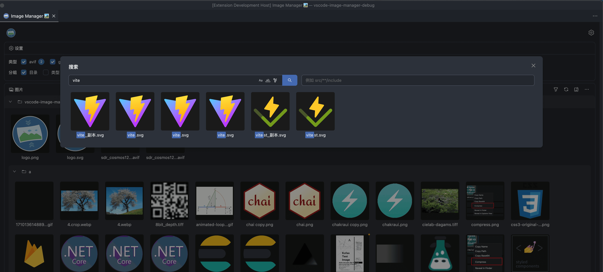
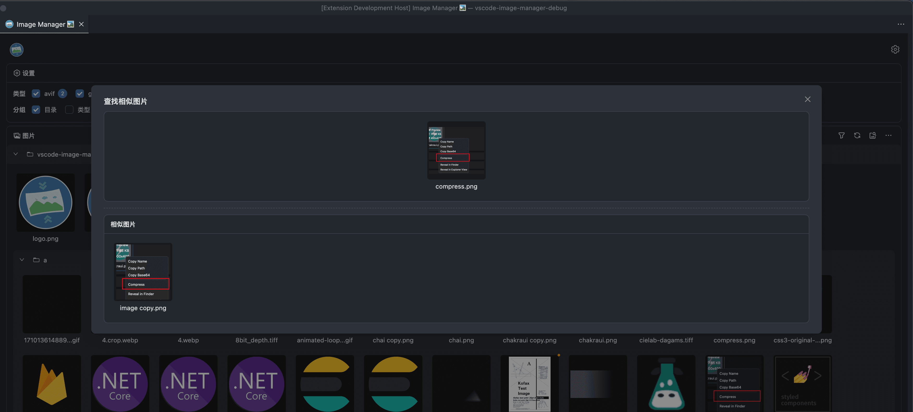

  

<h1 align='center'>Image Manager</h1>

强大易用的图片管理器

[English Document](./README.md)

## 文档

请阅读 [文档](https://hemengke1997.github.io/vscode-image-manager/zh/) 了解更多信息。

## 视频演示

<video src="https://github.com/user-attachments/assets/a75c4c88-25b8-4bb3-bf3b-94bc2c917b66"></video>

## 视频介绍

Bilibili 上有完整的视频，[点击这里](https://www.bilibili.com/video/BV15SQaYnEeJ)

## 截图

### 概览

### 大图预览

### 批量压缩

### 裁剪

### 图片查找

### 查找相似图片

## 支持作者

如果您喜欢我的项目并且想要支持我，您可以通过以下方式：

### GitHub

欢迎[点个 star](https://github.com/hemengke1997/vscode-image-manager) ⭐️

### 分享

如果您喜欢这个插件，也可以分享给您的朋友们，让更多的人知道这个插件！

### VSCode市场

欢迎在 [Marketplace](https://marketplace.visualstudio.com/items?itemName=minko.image-manager&ssr=false#review-details) 中给予好评，非常感谢！您的支持是我开源的最大动力

### 赞赏

| 微信                                       | 支付宝                                  |
| ------------------------------------------ | --------------------------------------- |
|  |  |

## 感谢

❤️ [vscode-image-viewer](https://github.com/ZhangJian1713/vscode-image-viewer)

❤️ [vscode-svgo](https://github.com/1000ch/vscode-svgo)
