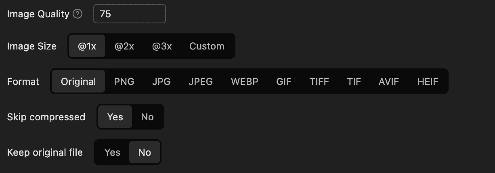
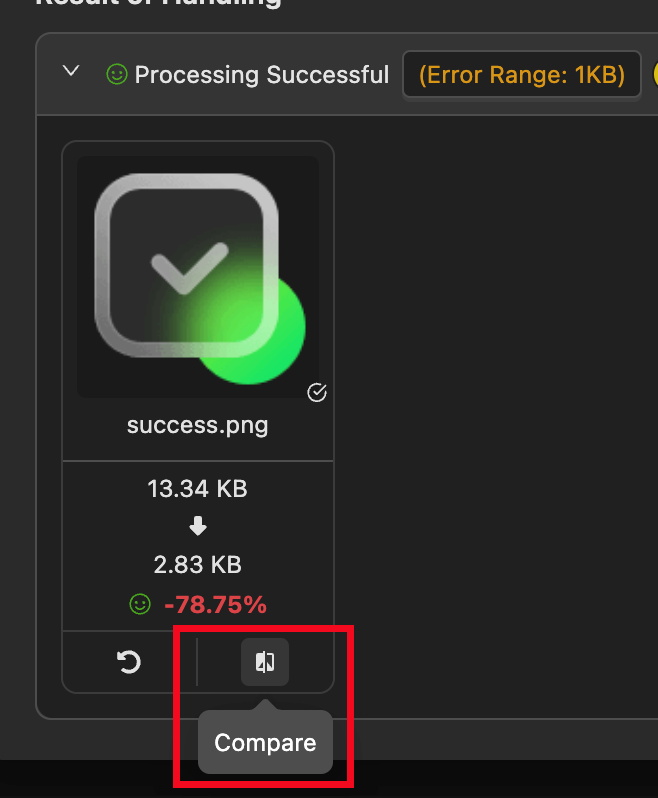
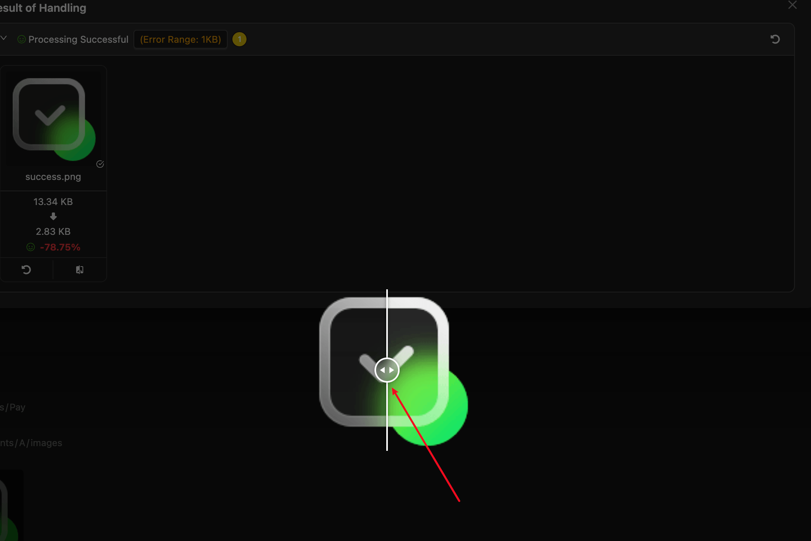
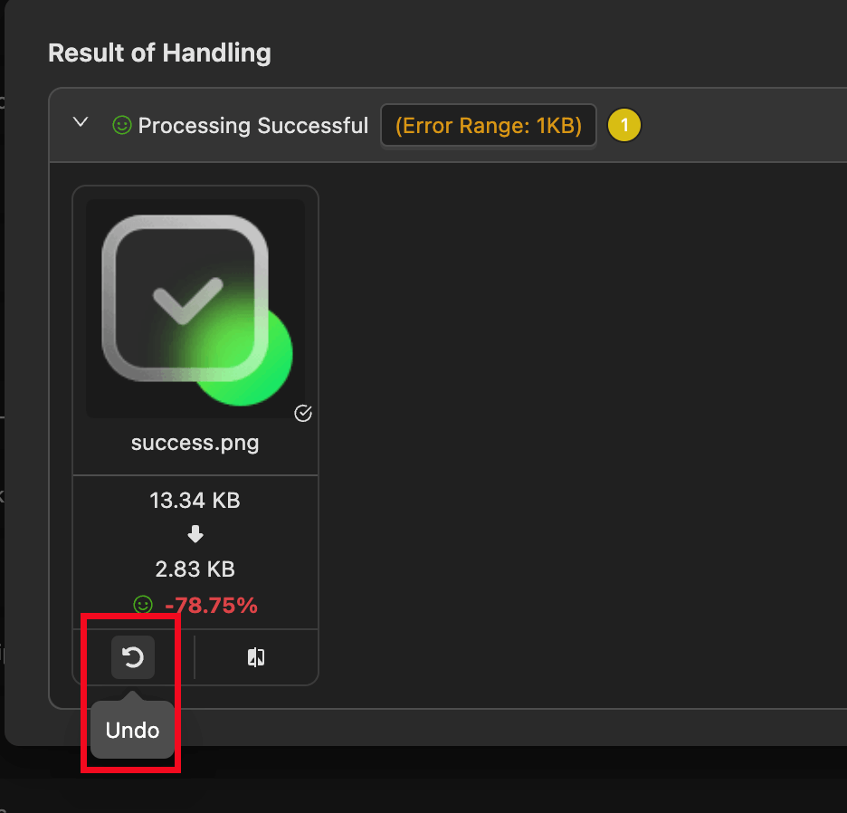

# Image Compression

Image compression supports the following formats: `'png', 'jpg', 'jpeg', 'webp', 'gif', 'tiff', 'tif', 'avif', 'heif', 'svg'`.

`svg` compression uses [`svgo`](https://svgo.dev/), while other formats use [`sharp`](https://sharp.pixelplumbing.com/).

## Compression Options

### Non-SVG

- **Image Quality**: `0-100`, `0` is the lowest quality, `100` is the highest quality. Default is `75`.
- **Image Size**: Scale image size proportionally, default is `100%`.
- **Image Format**: Convert image format if possible, default is `original format`.
- **Skip Compressed Images**: Whether to skip already compressed images, default is `true`.
- **Keep Original File**: Whether to keep the original file, default is `false`.

### SVG

- **Skip Compressed Images**: Whether to skip already compressed images, default is `true`.
- **Keep Original File**: Whether to keep the original file, default is `false`.

Click the `svgo config` button to configure `svgo` compression options. Refer to the [svgo documentation](https://svgo.dev/) for more details.

## View Compression Results

After compression, a popup will display the compression results as shown above.

## View Image Differences

Click the `Compare` button to view the differences between the original and compressed images.

You can drag the separator to view the differences between the original and compressed images. Drag left to display the original image and right to display the compressed image. You can also use the mouse wheel to zoom in and out.

### Undo Compression

If you are not satisfied with the compression results, click the `Undo` button to restore the original image.

### Error Range

If the image size increases beyond the error range, it is considered an increase; otherwise, it is considered a successful compression.

To save the compression status, the extension adds data to the image metadata, which may cause slight discrepancies.

## Check Compression Status

You can check if an image is compressed in the following ways:

1. A ✔ icon is displayed at the bottom right of the image.
2. Displayed in the image details.
3. Displayed when hovering over the image.

Some images cannot have metadata written, so their compression status cannot be determined.
