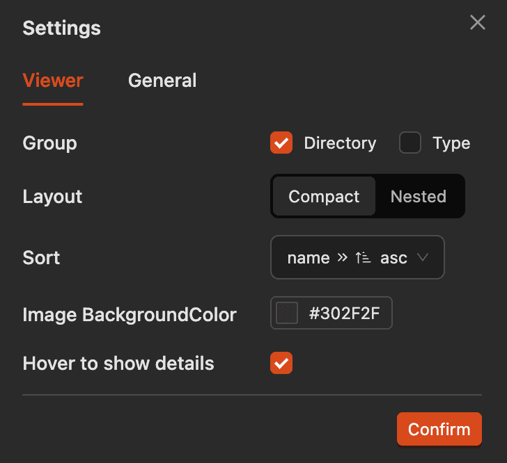
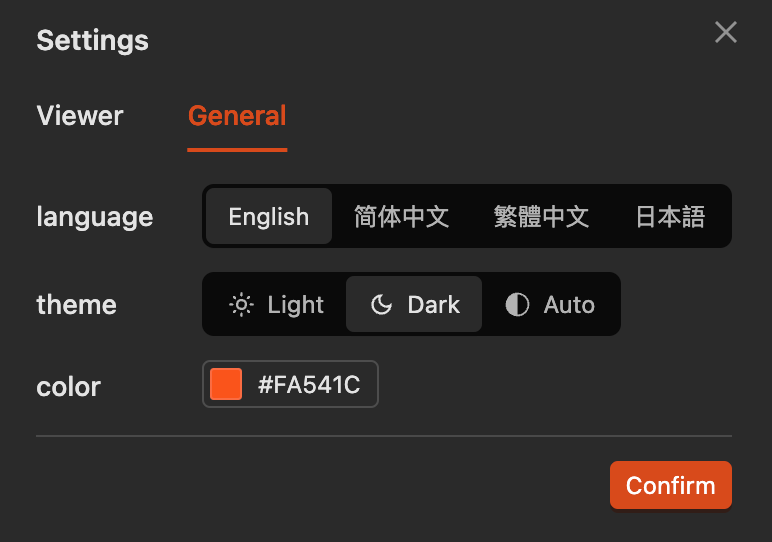

# Custom Settings

Click the settings button in the top right corner to customize settings.

## Viewer Settings

- **Grouping**: Group images by directory/type. If both are off, all images are displayed in a flat view.
- **Layout**: Compact layout collapses empty directories to avoid deep nesting.
- **Sorting**: Sort images by name/size.
- **Image Background Color**: Set the background color of images.
- **Show Details on Hover**: Control whether to show image details when hovering over an image.

## General Settings

- Light/Dark Mode
- Custom Theme Color
- Built-in support for 4 languages

