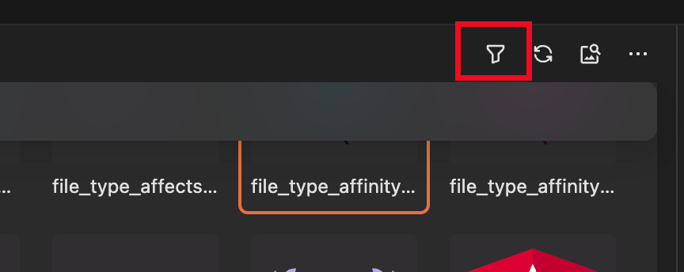
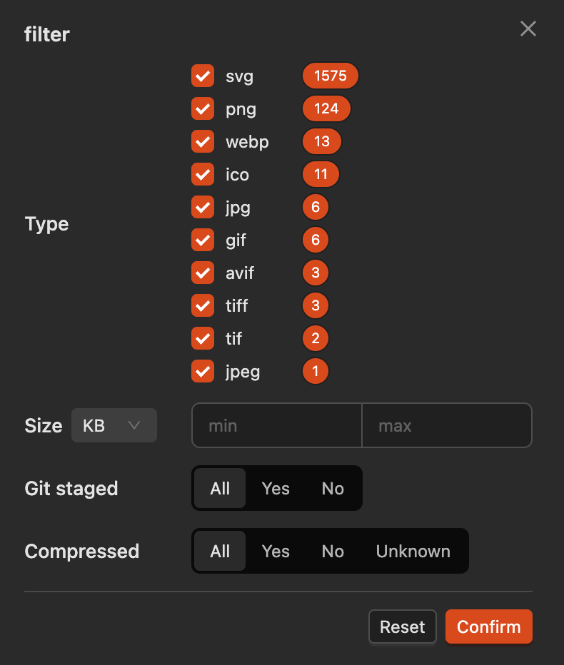

# Image Filtering

There is a filter on the right side of the viewer to help you quickly find the images you want.

## Filter Entry

## Filter Options

- **File Type**: Filter by image type
- **File Size**: Filter by image size
- **Git Staged Status**: Filter by Git staged status
- **Compression Status**: Filter by image compression status

When filtering is enabled, the filter entry button will be highlighted.
