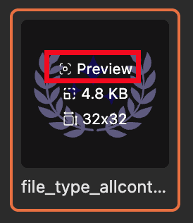
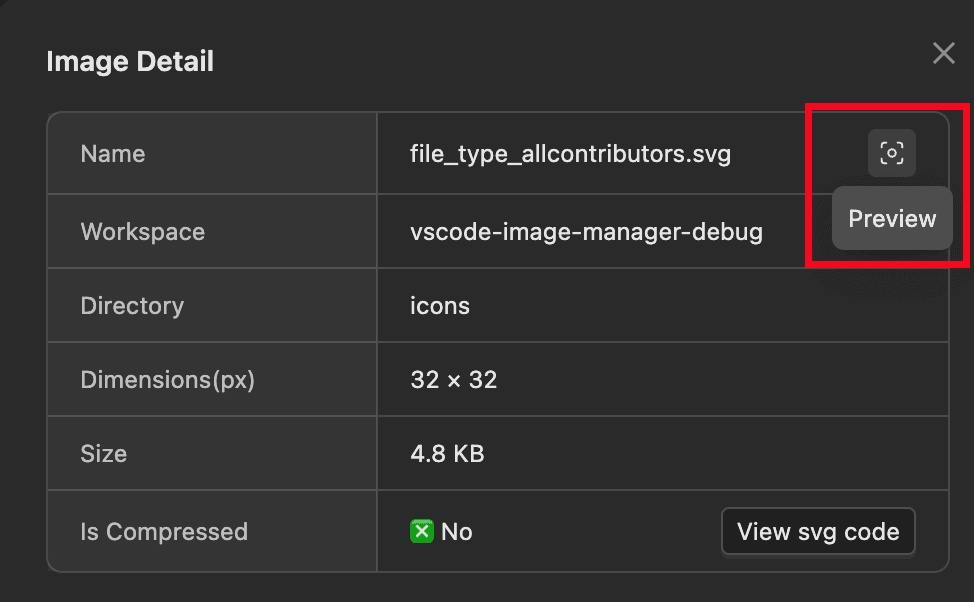

# Large Image Preview

If `image-manager.viewer.showDetailsOnHover` is `true`, hover over the image and click the preview button to view the large image.

If `image-manager.viewer.showDetailsOnHover` is `false`, double-click the image or right-click and select details, then click the preview button.

