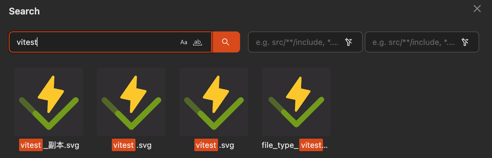

# Image Search

Image Manager provides a search function similar to VSCode, allowing you to search for all images in the current folder.

## Search Options

- **Case Sensitive**
- **Match Whole Word**
- **Include Directory**
- **Exclude Directory**
