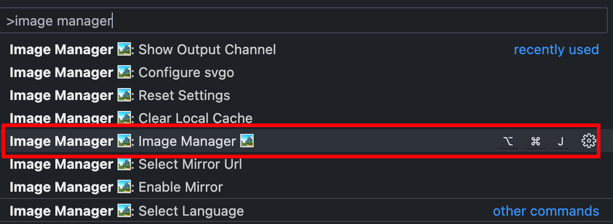
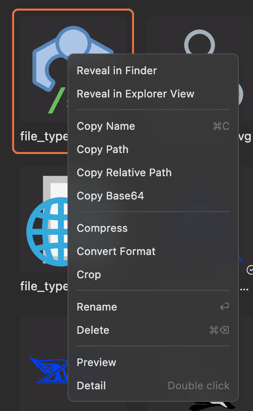
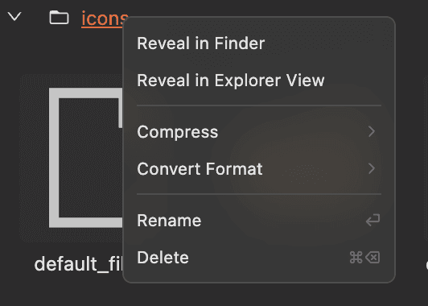

# Get Started

This guide will quickly introduce you to the key operations of Image Manager.

## Open the Extension

There are **3** ways to open the extension:

### 1. Keyboard Shortcut

- Windows: `Shift+Alt+J`
- macOS: `Cmd+Option+J`

### 2. Context Menu

Right-click in the Explorer and select `Image Manager` to open the extension (opens the current folder).

### 3. Command

Type `Image Manager` in the Command Palette to open the extension.

## Powerful Context Menu

In Image Manager, most operations are performed by right-clicking on an image or directory, making it very convenient.

### Right-click on an Image

### Right-click on a Directory

## Keyboard Shortcuts

For higher efficiency, Image Manager also supports some keyboard shortcuts.

Select an image or directory and press the shortcut key to perform the operation.

### Rename

- Windows: `F2`
- macOS: `⏎`

### Delete

- Windows: `Delete`
- macOS: `⌘ + ⌫`

### Copy Image

- Windows: `Ctrl + C`
- macOS: `⌘ + C`

### Cut Image

- Windows: `Ctrl + X`
- macOS: `⌘ + X`

### Paste Image

The shortcut takes effect after the directory is selected

- Windows: `Ctrl + V`
- macOS: `⌘ + V`

### View Image Details

`Double-click`

### Search Images

- Windows: `Ctrl + F`
- macOS: `⌘ + F`

## Multi-select

To multi-select images, hold down the `Shift / ⇧` or `Ctrl / ⌘` key, just like in the system file manager.

## Mouse Wheel

In the viewer, hold down `Ctrl / ⌘` and use the mouse wheel to zoom in or out.
