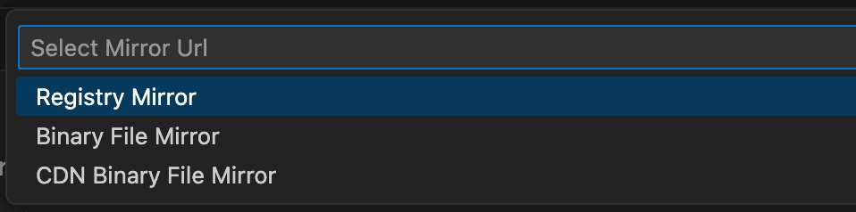

# FAQ

## Slow on First Launch?

The first time you open the extension, it may be slow because it needs to download necessary dependencies. This process depends on your network environment. Please be patient.

## Error: Dependency Installation Failed, Check Network

If you are in mainland China and have a poor network environment, there are two solutions:

1. Switch Mirror Source
2. Manually Install Dependencies

### Switch Mirror Source

Use the command palette, type `select mirror url`, and press Enter.

Then choose a mirror source, restart VS Code, and try downloading the dependencies again.

### Manually Install Dependencies

1. Open the command palette, type `Show Output Channel`, and select the Image Manager option.
2. Find the `Extension Root` in the output, you will need it later.
3. Download the dependencies from the URLs printed in the `Output Channel`.
4. Place the downloaded files in the `Extension Root` from step 2.
5. Restart VS Code.

## Can I use the extension without installing dependencies?

If you do not need features such as image compression, format conversion, or finding similar images, you can choose not to install dependencies. Set `image-manager.core.installDependencies: false` in `settings.json`.

Fortunately, you can still use most of the extension's features.

## Why Did the File Size Increase After Compression?

- Adding "compressed" metadata during compression may cause small images to increase in size.
- You can adjust the compression error range by setting `image-manager.compression.errorRange`.

## Too Many Images, Feels Laggy?

- Configure `image-manager.appearance.reduceMotion: 'on'` to reduce animation effects.
- Open a specific directory by right-clicking the folder to reduce the number of rendered images.
