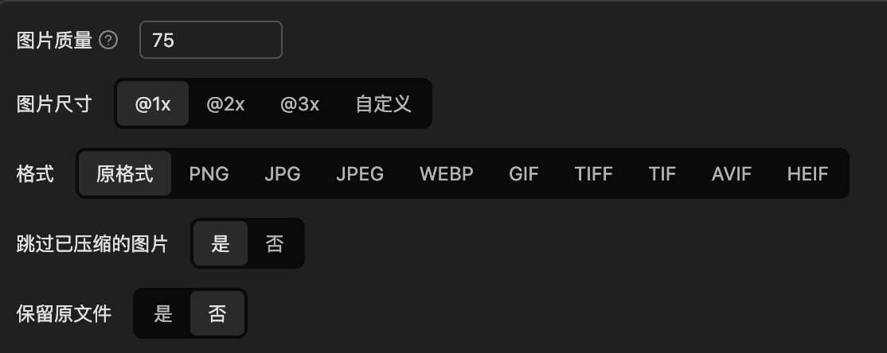
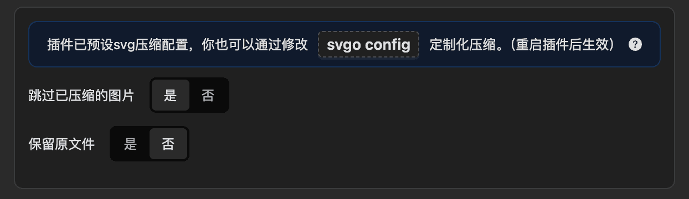

# 图片压缩

图片压缩支持 `'png', 'jpg', 'jpeg', 'webp', 'gif', 'tiff', 'tif', 'avif', 'heif', 'svg'` 格式。

其中 `svg` 压缩使用 [`svgo`](https://svgo.dev/) 压缩，其他格式使用 [`sharp`](https://sharp.pixelplumbing.com/) 压缩

## 压缩选项

### 非svg

- **图片质量**：`0-100`，`0` 为最低质量，`100` 为最高质量。默认 `75`。
- **图片尺寸**：按比例放大或缩小图片尺寸，默认 `100%`。
- **图片格式**：可压缩时转化图片格式，默认 `原格式`。
- **跳过已压缩图片**：是否跳过已压缩的图片，默认 `true`。
- **保留原文件**：是否保留原文件，默认 `false`。

### svg

- **跳过已压缩图片**：是否跳过已压缩的图片，默认 `true`。
- **保留原文件**：是否保留原文件，默认 `false`。

点击 `svgo config` 按钮，可以配置 `svgo` 压缩选项，请参考 [svgo官方文档](https://svgo.dev/)

## 查看压缩结果

图片压缩后，会弹窗显示图片压缩结果，展示信息如上图所示。

### 撤销压缩

如果对压缩结果不满意，可以点击 `撤销` 按钮，恢复原图。

### 误差范围

如果图片体积增大超过误差范围，才会视为图片增大，否则都认为压缩成功。

为了保存图片是否已压缩的信息，扩展会在图片元信息中添加数据，所以可能会导致图片有轻微的误差。

## 查看压缩状态

有如下方式查看图片是否已压缩：

1. 图片右下角显示 ✔ 图标
2. 图片详情中展示
3. hover图片时展示

因为部分图片无法写入元信息，所以判断不了是否已压缩
