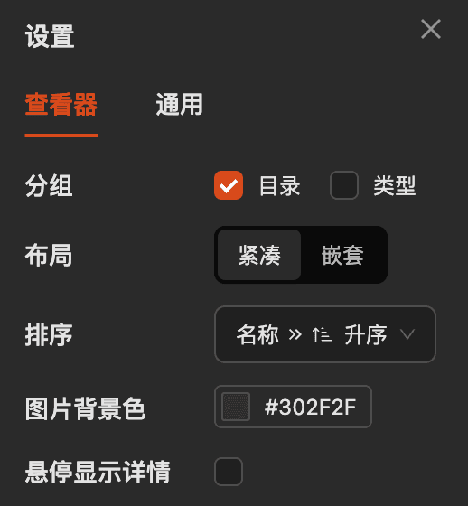
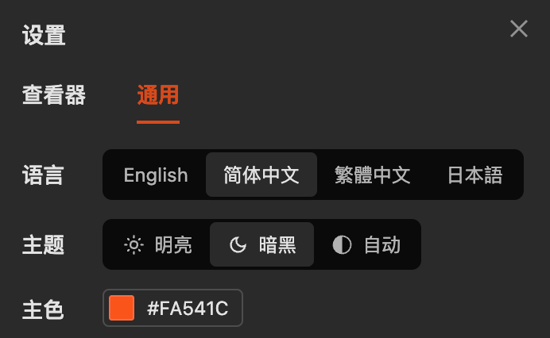

# 自定义设置

可点击右上角设置按钮进行自定义设置

## 查看器设置

- **分组**：可按照目录/类型对图片进行分组展示，如果都关闭，则平铺展示所有图片
- **布局**：紧凑布局会把无图片的目录收敛，避免嵌套过深
- **排序**：可按照名称/大小对图片进行排序
- **图片背景色**：可设置图片背景色
- **悬停显示详情**：控制鼠标悬停图片上时，是否显示图片详情

## 通用设置

- 明亮/暗黑模式
- 自定义主题色
- 内置 4 种语言

