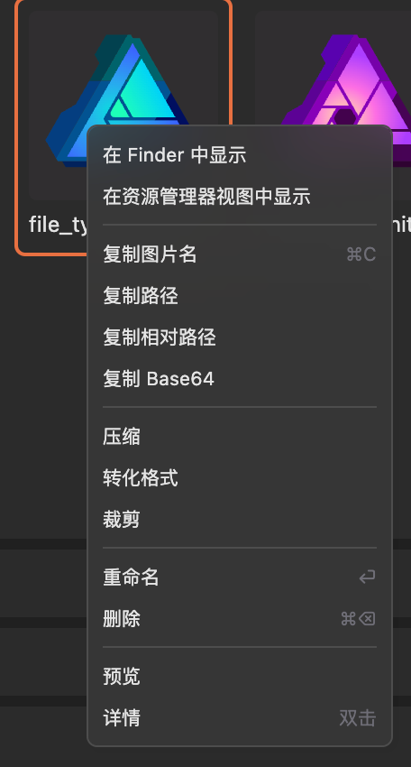
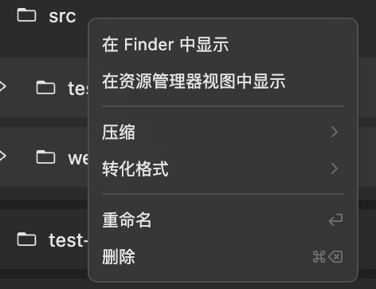

# 快速开始

以下带你快速了解 Image Manager 的重要操作。

## 打开扩展

有 **3** 种方式打开扩展：

### 1. 快捷键

- Windows: `Shift+Alt+J`
- macOS: `Cmd+Option+J`

### 2. 右键菜单

在资源管理器中右键，选择 `Image Manager` 打开扩展（打开当前文件夹）。

### 3. 命令

在命令面板中输入 `Image Manager` 打开扩展。

## 强大的右键菜单

Image Manager中，大部分操作都是通过右键图片或目录完成，非常方便。

### 右键图片

### 右键目录

## 快捷键

为了更高的效率，Image Manager也支持部分快捷键操作。

选中图片或目录后，按下快捷键即可完成操作。

### 重命名

- Windows: `F2`
- macOS: `⏎`

### 删除

- Windows: `Delete`
- macOS: `⌘ + ⌫`

### 复制图片

- Windows: `Ctrl + C`
- macOS: `⌘ + C`

### 剪切图片

- Windows: `Ctrl + X`
- macOS: `⌘ + X`

### 粘贴图片

选中目录后快捷键生效

- Windows: `Ctrl + V`
- macOS: `⌘ + V`

### 查看图片详情

`左键双击`

### 搜索图片

- Windows: `Ctrl + F`
- macOS: `⌘ + F`

## 多选

与系统多选文件方式一样，按住 `Shift / ⇧` 或 `Ctrl / ⌘` 键多选图片

## 鼠标滚轮

在查看器中，按住 `Ctrl / ⌘` + 鼠标滚轮可以放大或缩小图片
